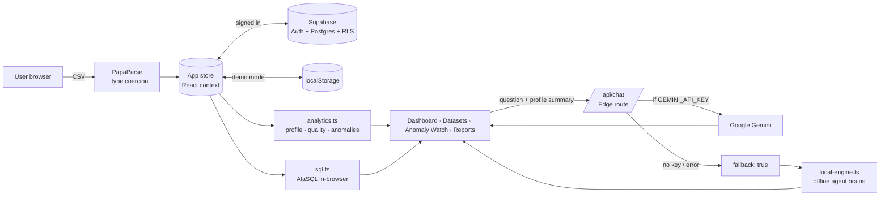

# 02 · Architecture

## High-level design



**Design principle:** heavy lifting happens *client-side*. The server only proxies the LLM call so the API key stays secret. This keeps hosting free and data private.

## Request flow — asking an agent
1. User types a question in **AI Agents**.
2. The client builds a **profile context** (`profileContext()`): column names/types, counts, means, top categories, monthly totals — *no raw rows*.
3. `POST /api/chat` with `{ agent, messages, context, apiKey? }`.
4. The Edge route adds the agent's system prompt and calls Gemini `generateContent`.
5. If there is no key, or Gemini fails, the route returns `{ fallback: true }` and the client uses `localAgentReply()` — answers computed from the actual data.
6. For the SQL agent, the SQL block is extracted and executed with AlaSQL against the in-memory dataset; results render as a table or chart.
7. Messages are saved per agent in the store and synced to the `chats` table (debounced) for signed-in users.

## Module map
| Module | Responsibility |
|---|---|
| `lib/store.tsx` | Global state: user, datasets, active dataset, chats, settings, usage. Signed-in users: loads the workspace from Supabase on login and diff-syncs changes (datasets insert/delete, chats & profile debounced upserts, lazy row loading). Demo mode: `localStorage`. |
| `lib/cloud.ts` | Supabase client and all database calls |
| `supabase/schema.sql` | Tables `profiles`, `datasets`, `chats`; RLS policies; sign-up trigger |
| `lib/analytics.ts` | `coerceRows`, `profileDataset`, `autoClean`, `groupBy`, `timeSeries`, `detectAnomalies`, `correlation`, `suggestCharts`, `toCSV` |
| `lib/local-engine.ts` | `textToSQL`, `explainSQL`, per-agent reply generators, `profileContext` |
| `lib/sql.ts` | Safe SELECT-only execution with AlaSQL (`FROM data` → in-memory table) |
| `lib/agents.ts` | Agent metadata, colours, suggestions and system prompts |
| `lib/auth.ts` | Supabase Auth: email/password, Google OAuth (PKCE), email confirmation, password reset. Demo fallback without keys |
| `lib/sample-data.ts` | Seeded PRNG generators for 3 realistic datasets |
| `app/api/chat/route.ts` | Edge function → Gemini, with graceful fallback |
| `components/dash/Shell.tsx` | Sidebar, top bar, dataset switcher, notifications, ⌘K palette, route guard |

## State shape
```ts
{
  user: { name, email, role, company, bio, location, avatarSeed, plan, joined } | null,
  datasets: [{ id, name, source: "sample" | "upload", sampleId?, rows?, cleaned?, cleanLog? }],
  activeId: string | null,
  chats: { cleaner: Msg[], sql: Msg[], viz: Msg[], marketing: Msg[], advisor: Msg[] },
  settings: { geminiKey, anomalyThreshold, emailAlerts, weeklyDigest },
  usage: { queries, tokens }
}
```
Sample datasets are stored by reference (`sampleId`) and regenerated deterministically, so they cost no storage.

## Security & privacy
- API key lives in Vercel env vars (server only). A user-supplied key is stored in *their* browser and forwarded only to Gemini.
- SQL runner rejects anything other than `SELECT` / `WITH`.
- LLM context excludes raw rows.

## Production upgrade path
| Demo piece | Production swap |
|---|---|
| Datasets as JSON rows (≤ 6 MB each) | Supabase Storage / S3 + DuckDB-WASM for >100 MB |
| Simulated billing | Razorpay / Stripe subscriptions + webhooks |
| In-app alerts | Cron job (Vercel Cron) + Resend email / Slack webhook |
